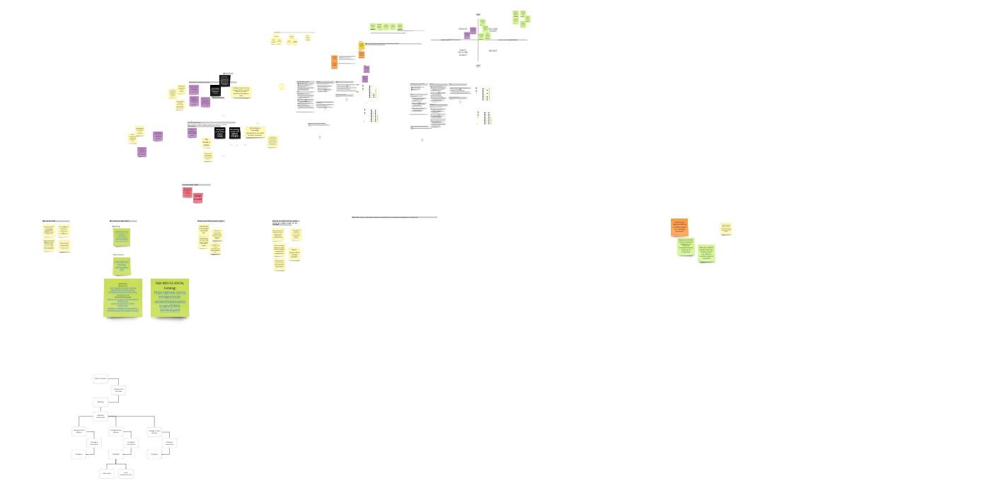

# Architecture Decision Record 7-15-22

## Status
Proposed

## Context

What is the issue that we're seeing that is motivating this decision or change?

Goal: Provide increased value to the ecosystem of DoD developers and authorizing officials at a steady pace and with a consistent team.

The team evaluated current technology and implementations in the OSCAL ecosystem - then worked through answering a few core questions:
- What do we know?
- What work has been done?
- Where do we think we want to go?
- What do we still need to answer before we confirm scope and get started?

Performed a personas exercise for:
- Developer Persona
- Security Official Persona

Combining these efforts, we developed the three main area's of focus for the effort:
- Generation
    - How might we lower the barrier to entry for generating OSCAL documents at both the application developer layer and consumer layer?
- Tailoring
    - How might we take the controls that can be satisfied and accurately identify what controls are satisfied given the configuration?
- Visualization
    - How might we provide insight to know what controls are satisfied at any given time?

### Miro

https://miro.com/app/board/uXjVOlnhTak=/?share_link_id=33536635903

## Decision

Focusing on the developer persona and the barrier to entry (or optimization thereof) for producing OSCAL documents.
- Consuming existing catalogs and providing an interactive method for building and generating an OSCAL document for applicable controls.
- Implementing a schema that allows for specifying _when_ a control has been satisfied (IE configuration)
- Determining whether there are dynamics and other ways to satisfy control or just a one concept schema to specify satisfied control.

Stretch goals for taking the output of the above process and providing a mechanism for generating an OSCAL document based on the configurations for a specific environment/deployment.

## Consequences

- OSCAL is better understood and more easily translatable by tool application developers
- Applications and open source can collaborate on declaration and maintenance of controls more easily
- Versioned documents allow other OSCAL tooling to develop automations that consume the documents and provide reconciliation of that state (API driven etc)
