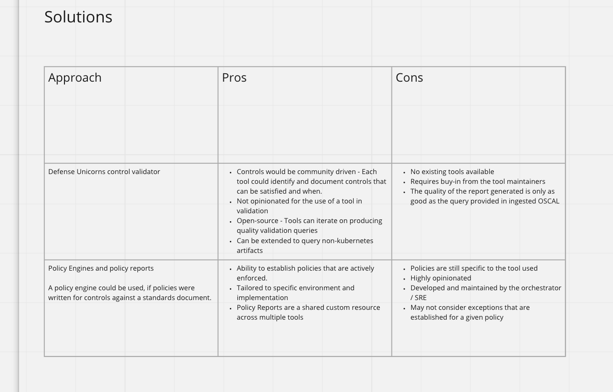
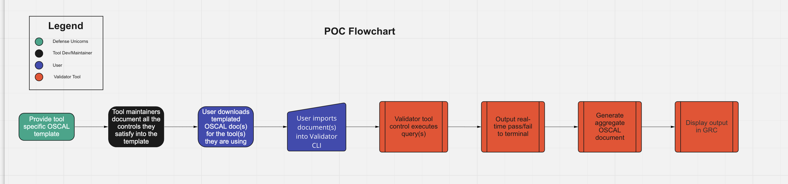

# Architecture Decision Record - Dash Days 2 (17-18 August)

## Context
TEAM-OSCAL approached Dash Days #2 of Dash Days of Summer with two aims:
1. Conduct research and comparison on existing tools, projects, approaches within the ecosystem that we could leverage; and 
2. Define the initial scope of a proof of value as a target to demo at the end of September after the conclusion of Dash Days # 3.

Between Dash Days 1 and 2 the team conducted engagements with different industry stakeholders to further refine the scope of a proof 
of value. The conversations led the team to revisit and reconsider the accreditation value stream as many of our initial identified pain 
points along that value stream:
- Time spent by developers explaining configurations to security or authorizing officials in order to do control mapping; time spent by developers generated initial “umbrella” OSCAL documentation for a specific tool 
- Difficulty knowing what controls are satisfied by a given configuration
- How to validate a specific configuration is in fact the configuration running (or otherwise how to validate the state of the cluster and relevant platform and infrastructure layers that affect controls)
- How to monitor relevant states and know at any given time what controls are satisfied
- How to better represent to security and authorizing officials the state of configurations and relevant satisfied controls 

At the conclusion of Dash Days 1 the team determined that the best way ahead was to focus narrowly on the developer persona and specifically on the pain associated with manual generation of tool-specific OSCAL documentation.
However, upon revisiting the value stream it became clear that shifting the focus of the PoV downstream to configuration-specific documentation and auditing could potentially reduce pain and churn for the other personas. 

We hypothesized that creation of an extensible tool that can combine compliance rule-sets (standards) with automated validation could over time streamline and potentially speed the security compliance and accreditation processes for software. 

## Analysis
The team reviewed the known, existing body of work to validate the full solution space. 

Review included open source projects and repos and policy engines and policy reports:

[K8s-to-oscal] (https://github.com/kubernetes-sigs/wg-policy-prototypes/tree/master/policy-report/oscal-transformer) working group
Findings
  - uses Kyverno as a policy enforce and [compliance-trestle] (https://github.com/IBM/compliance-trestle) as transfomer for K8S YAML to OSCAL JSON
  - Highly opinionated based on the policy; presents a high barrier to entry for complex rule-sets such as NIST 8005-3

[Compliance-Trestle](https://github.com/IBM/compliance-trestle)
Findings
  - Helps work with OSCAL docs
  - Can segment larger rule set docs into different “classes”
     - Aggregation
     - Linting
 -  Project still getting off the ground
 - May be better suited to aid in creation of initial component “universe” documents (i.e., component-level docs that declare all the controls that _could_ be satisfied for a given system)
 - Little existing work on OSCAL automation

## Conclusion
Proof of Value for Defense Unicorns’ dash days will be scoped as follows:
  - Assumes existing universe-level component OSCAL documents
  - Component OSCAL doc leverage includes (where applicable) _when_ a control is satisfied
  - Defense Unicorns’ tool will ingest the OSCAL document, perform validation on whether the system is compliant/non-compliant for at least one control 
  - Tool generates a report in OSCAL
  - As a stretch goal Defense Unicorns will look to have the OSCAL-based report ingested by a governance risk compliance (GRC) tool to present visualization. 
  
  
